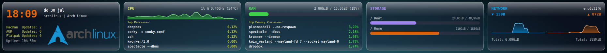
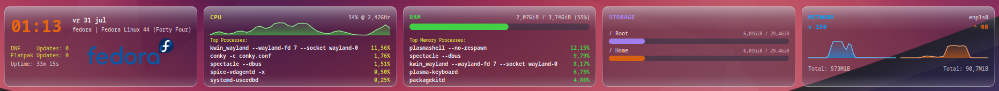

# conky-horizontal

A single-file, all-Lua/Cairo horizontal system monitor bar for [Conky](https://github.com/brndnmtthws/conky), with a liquid-glass visual style. Five panels in one wide strip: date/time & updates, CPU, RAM, storage, and network.





## Features

- **Date & time** — clock, date, hostname, uptime
- **Updates** — Pacman (`checkupdates`), plus optional AUR (`yay`/`paru`) and Flatpak lines, each on its own row
- **CPU** — live load graph that shifts green → yellow → red with load, frequency, temperature (read straight from `/sys/class/hwmon`, no `lm_sensors` needed), top 5 processes by CPU
- **RAM** — usage bar, top 5 processes by memory
- **Storage** — usage bars for `/` and `/home`
- **Network** — live up/down speed and session totals, with side-by-side auto-scaling graphs (each capped at its own configurable MB/s ceiling)
- **Optional logo overlay** — fixed position, height set in config, width follows the image's own aspect ratio automatically
- Every graph (CPU, download, upload) has its own settings block for height, colors, fill/line opacity, and history length

## Requirements

- `conky`, built with Lua/Cairo support
- A Cairo-capable Lua binding: `conky_surface()` is used when available (works on both X11 and Wayland); the widget falls back to `cairo_xlib_surface_create()` (via `require("cairo_xlib")`) on older builds
- `ttf-dejavu` (or another monospace font — see `CFG.font` in `widget.lua`)
- `pacman-contrib` for `checkupdates` (Arch/pacman update count)
- `yay` or `paru`, only if you want the AUR updates line
- `flatpak`, only if you want the Flatpak updates line
- No `lm_sensors` required — CPU temperature is read directly from `/sys/class/hwmon` (auto-detects `coretemp`/`k10temp`/`zenpower`); the temperature is simply omitted if no matching sensor is found

## Files

| File | Purpose |
| --- | --- |
| `conky.conf` | Window/rendering settings; loads `widget.lua` |
| `widget.lua` | Everything else: layout, drawing, data sources, caching |
| `autostart.sh` | Kills any running Conky and (re)starts it with `conky.conf` |
| `logo.png` | Optional logo shown by the logo overlay (see Configuration) |

Two files driving the widget is intentional — everything that can live in Lua does, so there's nothing else to keep in sync.

## Installation

```bash
git clone https://github.com/wim66/conky-horizontal.git ~/.conky/conky-horizontal
cd ~/.conky/conky-horizontal
```

1. Open `widget.lua` and edit the `CFG` table for your machine (see below) — at minimum, set `network_iface`.
2. Run it directly:

   ```bash
   conky -c conky.conf
   ```

   or manage it with [Conky Manager 2](https://github.com/zcot/conky-manager2), or use the included `autostart.sh` to (re)start it, e.g. from your session's autostart.

## Configuration

All settings live at the top of `widget.lua`, in the `CFG` table:

```lua
local CFG = {
    network_iface = "enp0s31f6",  -- your network interface, e.g. via `ip a`
    aur_helper = "yay",           -- "yay", "paru", or "none" to disable AUR checks
    show_flatpak = true,          -- include a Flatpak updates line

    net_max_download = 30,        -- MB/s -- download graph ceiling
    net_max_upload   = 6,         -- MB/s -- upload graph ceiling

    logo = {
        path   = script_dir() .. "logo.png",  -- next to widget.lua by default, or an absolute path
        x = 10, y = 10,
        height = 40,               -- width is derived automatically
    },

    colors = { ... },             -- accent colors used throughout the widget
    graphs = { ... },              -- per-graph height/color/opacity/history settings
}
```

- **`network_iface`**: set this to your active interface (`ip -brief link` or `ip a`).
- **`aur_helper`**: leave as `"yay"`/`"paru"` if installed, or set to `"none"` to skip the AUR check entirely.
- **`show_flatpak`**: set to `false` if you don't use Flatpak, to skip that check.
- **`net_max_download` / `net_max_upload`**: the hard ceiling each network graph will scale to. The graph still auto-zooms to recent traffic for readability at low usage, but never exceeds this ceiling — so a saturated link is visible as a graph pressed against the top.
- **`logo`**: set `path` to your image, position it with `x`/`y`, and pick a `height` — the width always follows the image's real aspect ratio.
- **`graphs.cpu` / `graphs.net_down` / `graphs.net_up`**: independent height, color, fill/line opacity, and history-length (`samples`) settings per graph. CPU's `dynamic_color` (on by default) overrides its static `color` with a green/yellow/red load-based color.

## Credits

By [@wim66](https://github.com/wim66), built with [Claude](https://claude.ai).
